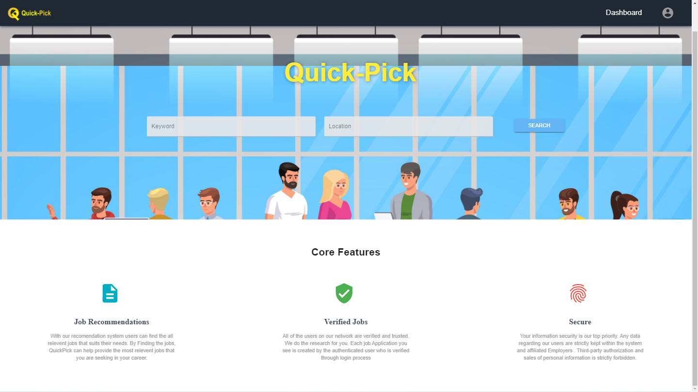
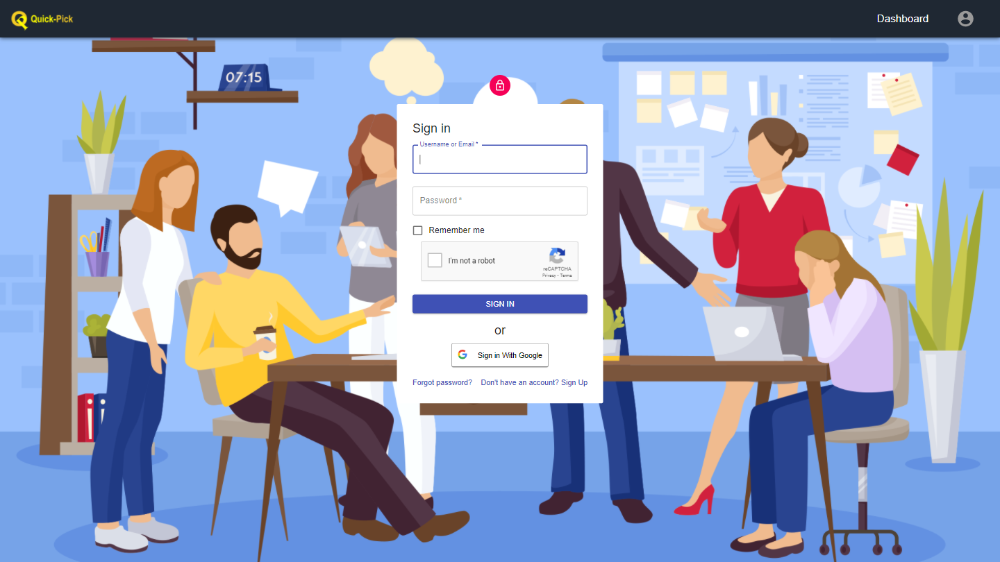
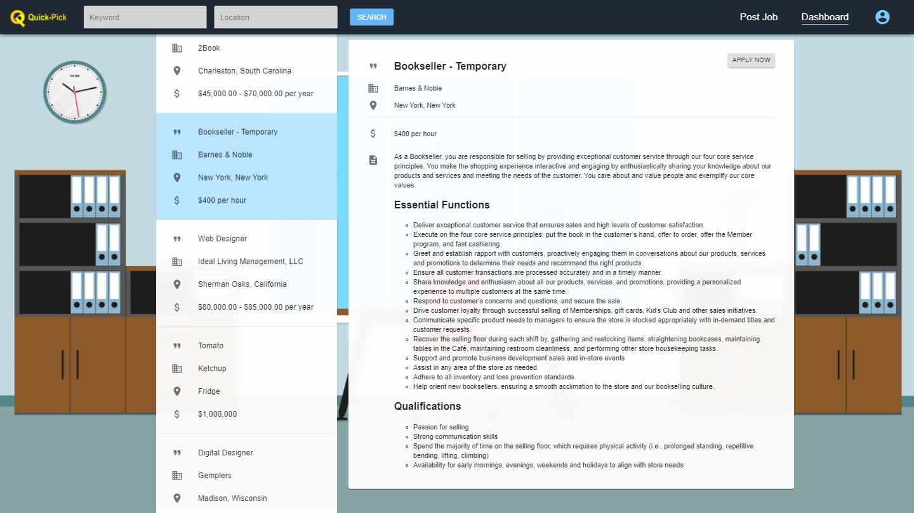
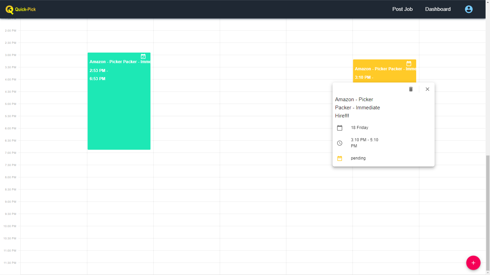
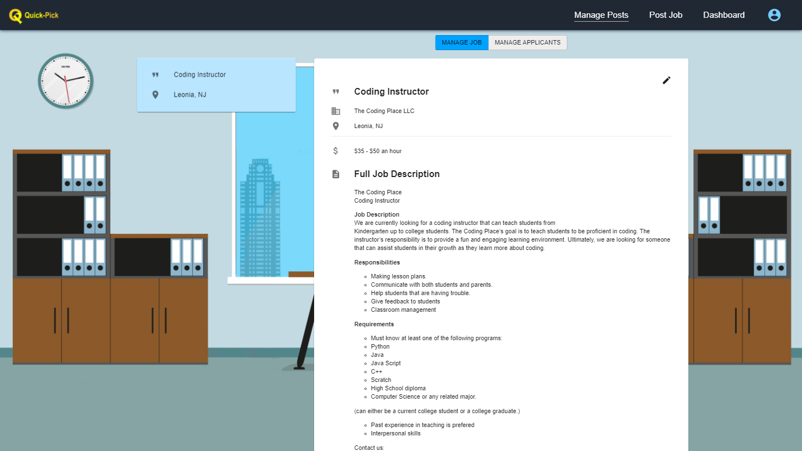

### Click Logo For Demo

---

### About

Quick-Pick is a job portal website for anyone who needs a second job, are unable to work on a fixed schedule, or simply have a limit on their availability.

Our dream is to help everyone find meaningful and fulfilling employment. Quick-Pick will verify a user’s identity to help match them with a job, and then they can create their own job listing creating a level of trust between our websites and employers.

The website tracks availability to match the seekers and employers, and checks qualifications and skills. Once the connection is made, the seeker and employer can easily communicate to find the best shifts and schedule based on their needs.

---

### Features
#### Login/Sign Up
- Google Authentication
- Captcha
- Forgot Password
#### Searching
- Can search by job title and location
#### Chatting
- Can message other users
#### Shift Selection
- Can select times you are available to work for jobs you applied to
#### Certification
- Can takes certification tests that will be displayed on your profile
#### Profile Page
- Upload profile picture and resume
- View status of jobs you created/applied to
- View status of shifts you created
#### Job Creation and Management
- Any user can create a job and can manage applicants

 
 
 

---

### Tech Stack
| Frontend | Backend | Deployment |
| ----------- | ----------- | ----------- |
| React | Spring Boot | Heroku |
|  | PostgreSQL |  |

---

### Frontend Deployment
The code for our frontend can be found in the branch titled Frontend-deployment.

### Backend Deployment
The code for our backend can be found in the branch titled Backend-deployment.
